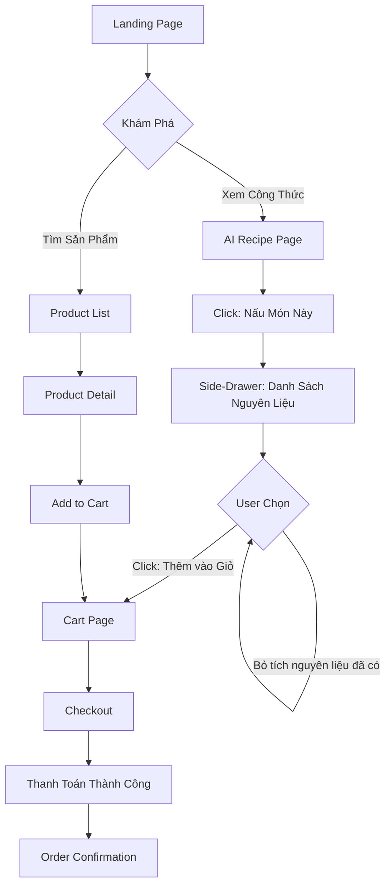
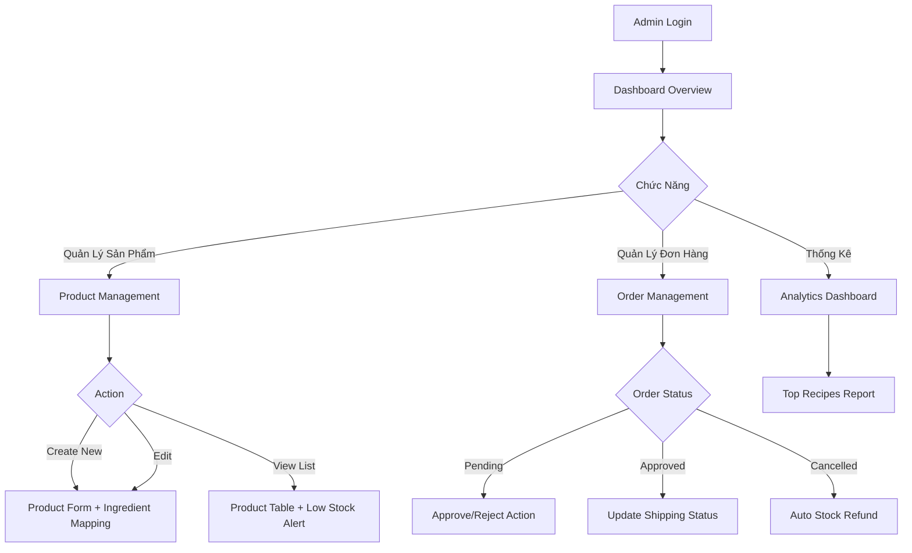

# Ecommerce_Shop - Đặc Tả Hệ Thống Hoàn Chỉnh

> **Version**: 1.0  
> **Tech Stack**: React + Vite + TypeScript (Frontend) | Node.js/NestJS + MySQL (Backend)  
> **Design Philosophy**: SaaS Premium, Dark Mode, Glassmorphism, AI-Driven UX

---

## 📋 Mục Lục

1. [Tầm Nhìn Sản Phẩm](#1-tầm-nhìn-sản-phẩm)
2. [Hành Trình Người Dùng (UX Flow)](#2-hành-trình-người-dùng-ux-flow)
3. [Database Schema & ERD](#3-database-schema--erd)
4. [Design System](#4-design-system)
5. [Component Architecture](#5-component-architecture)
6. [API Specification](#6-api-specification)
7. [AI Recipe Suggestion Logic](#7-ai-recipe-suggestion-logic)
8. [Authentication & Authorization (RBAC)](#8-authentication--authorization-rbac)
9. [Performance & Security](#9-performance--security)

---

## 1. Tầm Nhìn Sản Phẩm

### 1.1 Product Vision

**Ecommerce_Shop** là nền tảng thương mại điện tử thế hệ mới kết hợp **AI gợi ý món ăn thông minh** với trải nghiệm mua sắm nguyên liệu nhanh chóng. Hệ thống giúp người dùng:

- **Khám phá công thức nấu ăn** phù hợp với nguyên liệu có sẵn trong kho
- **Mua nguyên liệu một cách tối ưu** thông qua AI suggestion
- **Quản lý đơn hàng hiệu quả** với dashboard admin chuyên nghiệp

### 1.2 Người Dùng Mục Tiêu

| Persona | Nhu Cầu | Pain Points |
|---------|---------|-------------|
| **👤 User (Khách Hàng)** | Tìm công thức nấu ăn ngon, mua nguyên liệu nhanh | Không biết nấu gì, mất thời gian đi chợ |
| **👨‍💼 Admin (Quản Trị)** | Quản lý sản phẩm, duyệt đơn hàng, mapping nguyên liệu | Khó theo dõi stock, duyệt đơn thủ công |

---

## 2. Hành Trình Người Dùng (UX Flow)

### 2.1 User Journey - Storefront



**Chi tiết từng bước:**

1. **Landing Page**: Hero section với CTA "Khám phá công thức AI" + Featured Products
2. **AI Recipe Page**: Grid layout các món ăn có thể nấu (filter by mood_tags)
3. **Side-Drawer Nguyên Liệu**: 
   - Hiển thị danh sách ingredients với hình ảnh sản phẩm
   - Checkbox mặc định được tích
   - Nút "Thêm [n] sản phẩm vào giỏ" sticky bottom
4. **Cart → Checkout**: Standard flow với quantity adjustment

### 2.2 Admin Journey - Dashboard



**Admin Workflow chính:**

1. **Product Management**:
   - Xem danh sách sản phẩm với badge "Low Stock" (< 10)
   - Form Thêm/Sửa có **Searchable Dropdown** mapping ingredient
   - Upload hình ảnh sản phẩm

2. **Order Management**:
   - Danh sách đơn hàng realtime
   - Action: Approve → Stock chính thức trừ | Reject → Hoàn stock
   - Update trạng thái vận chuyển

---

## 3. Database Schema & ERD

### 3.1 Entity Relationship Diagram

```mermaid
erDiagram
    USERS ||--o{ ORDERS : places
    USERS {
        int id PK
        string email UK
        string password_hash
        enum role "user, admin"
        string full_name
        string phone
        text address
        datetime created_at
        datetime updated_at
    }
    
    PRODUCTS ||--o{ ORDER_ITEMS : contains
    PRODUCTS ||--o{ CART_ITEMS : in_cart
    PRODUCTS ||--o{ PRODUCT_INGREDIENTS : maps_to
    PRODUCTS {
        int id PK
        string name
        string sku UK
        text description
        decimal price
        int stock_quantity
        string image_url
        int category_id FK
        boolean is_active
        datetime created_at
        datetime updated_at
    }
    
    CATEGORIES ||--o{ PRODUCTS : categorizes
    CATEGORIES {
        int id PK
        string name
        string slug UK
        text description
    }
    
    INGREDIENTS ||--o{ PRODUCT_INGREDIENTS : links
    INGREDIENTS {
        int id PK
        string name UK
        text description
        datetime created_at
    }
    
    PRODUCT_INGREDIENTS {
        int id PK
        int product_id FK
        int ingredient_id FK
        boolean is_primary
        int priority
    }
    
    RECIPES {
        int id PK
        string name
        json mood_tags
        int cooking_time_min
        json ingredients_spec
        json steps
        string image_url
        int view_count
        datetime created_at
    }
    
    ORDERS ||--o{ ORDER_ITEMS : includes
    ORDERS {
        int id PK
        int user_id FK
        string order_number UK
        enum status "pending, approved, shipping, completed, cancelled"
        decimal total_amount
        text shipping_address
        text notes
        datetime approved_at
        datetime created_at
        datetime updated_at
    }
    
    ORDER_ITEMS {
        int id PK
        int order_id FK
        int product_id FK
        int quantity
        decimal unit_price
        decimal subtotal
    }
    
    CART_ITEMS {
        int id PK
        int user_id FK
        int product_id FK
        int quantity
        datetime created_at
        datetime updated_at
    }
```



### 3.2 Bảng Chi Tiết

#### **Table: users**
| Column | Type | Constraint | Description |
|--------|------|------------|-------------|
| id | INT | PK, AUTO_INCREMENT | User ID |
| email | VARCHAR(255) | UNIQUE, NOT NULL | Email đăng nhập |
| password_hash | VARCHAR(255) | NOT NULL | Bcrypt hash |
| role | ENUM('user', 'admin') | DEFAULT 'user' | Phân quyền |
| full_name | VARCHAR(255) | NULL | Họ tên |
| phone | VARCHAR(20) | NULL | Số điện thoại |
| address | TEXT | NULL | Địa chỉ giao hàng |
| created_at | DATETIME | DEFAULT NOW() | Ngày tạo |
| updated_at | DATETIME | ON UPDATE NOW() | Ngày cập nhật |

#### **Table: products**
| Column | Type | Constraint | Description |
|--------|------|------------|-------------|
| id | INT | PK, AUTO_INCREMENT | Product ID |
| name | VARCHAR(255) | NOT NULL | Tên sản phẩm |
| sku | VARCHAR(100) | UNIQUE, NOT NULL | Mã SKU |
| description | TEXT | NULL | Mô tả sản phẩm |
| price | DECIMAL(10,2) | NOT NULL | Giá bán |
| stock_quantity | INT | DEFAULT 0 | Số lượng kho |
| image_url | VARCHAR(500) | NULL | URL hình ảnh |
| category_id | INT | FK → categories.id | Danh mục |
| is_active | BOOLEAN | DEFAULT TRUE | Trạng thái |
| created_at | DATETIME | DEFAULT NOW() | Ngày tạo |
| updated_at | DATETIME | ON UPDATE NOW() | Ngày cập nhật |

#### **Table: product_ingredients** (Mapping Table)
| Column | Type | Constraint | Description |
|--------|------|------------|-------------|
| id | INT | PK, AUTO_INCREMENT | Mapping ID |
| product_id | INT | FK → products.id | Sản phẩm |
| ingredient_id | INT | FK → ingredients.id | Nguyên liệu |
| is_primary | BOOLEAN | DEFAULT TRUE | Nguyên liệu chính? |
| priority | INT | DEFAULT 0 | Độ ưu tiên (cao = gợi ý trước) |

**Logic**: Ví dụ ingredient "Gạo" (id=1) map với 3 products:
- Product "Gạo ST25" (id=101, priority=100)
- Product "Gạo Tám Thơm" (id=102, priority=80)
- Product "Gạo Nhật" (id=103, priority=50)

→ AI ưu tiên chọn "Gạo ST25" khi gợi ý món.

#### **Table: ingredients**
| Column | Type | Constraint | Description |
|--------|------|------------|-------------|
| id | INT | PK, AUTO_INCREMENT | Ingredient ID |
| name | VARCHAR(255) | UNIQUE, NOT NULL | Tên nguyên liệu chuẩn |
| description | TEXT | NULL | Mô tả |
| created_at | DATETIME | DEFAULT NOW() | Ngày tạo |

**Data Source**: Trích xuất từ [recipes.json](file:///d:/Vibe_code/Ecommerce_Shop/recipes.json). Ví dụ:
```
Thịt ba chỉ, Trứng gà, Nước mắm, Đường, Hành tím, Tiêu, Cá, Thịt gà, Gừng, Tỏi...
```

#### **Table: recipes**
| Column | Type | Constraint | Description |
|--------|------|------------|-------------|
| id | INT | PK | Recipe ID từ JSON |
| name | VARCHAR(255) | NOT NULL | Tên món ăn |
| mood_tags | JSON | NULL | Tags: daily, comfort, gym... |
| cooking_time_min | INT | NULL | Thời gian nấu (phút) |
| ingredients_spec | JSON | NULL | Chi tiết nguyên liệu từ JSON |
| steps | JSON | NULL | Các bước nấu |
| image_url | VARCHAR(500) | NULL | Hình ảnh món ăn |
| view_count | INT | DEFAULT 0 | Số lượt xem |
| created_at | DATETIME | DEFAULT NOW() | Ngày tạo |

**Note**: Bảng này sync từ [recipes.json](file:///d:/Vibe_code/Ecommerce_Shop/recipes.json), không cho phép Admin CRUD trực tiếp.

#### **Table: orders**
| Column | Type | Constraint | Description |
|--------|------|------------|-------------|
| id | INT | PK, AUTO_INCREMENT | Order ID |
| user_id | INT | FK → users.id | Người đặt hàng |
| order_number | VARCHAR(50) | UNIQUE, NOT NULL | Mã đơn (ORD-YYYYMMDD-XXXX) |
| status | ENUM | pending, approved, shipping, completed, cancelled | Trạng thái |
| total_amount | DECIMAL(10,2) | NOT NULL | Tổng tiền |
| shipping_address | TEXT | NOT NULL | Địa chỉ giao hàng |
| notes | TEXT | NULL | Ghi chú |
| approved_at | DATETIME | NULL | Thời gian Admin duyệt |
| created_at | DATETIME | DEFAULT NOW() | Ngày đặt |
| updated_at | DATETIME | ON UPDATE NOW() | Ngày cập nhật |

**Order Status Flow**:
```
pending → approved → shipping → completed
        ↘ cancelled
```

#### **Table: order_items**
| Column | Type | Constraint | Description |
|--------|------|------------|-------------|
| id | INT | PK, AUTO_INCREMENT | Item ID |
| order_id | INT | FK → orders.id | Đơn hàng |
| product_id | INT | FK → products.id | Sản phẩm |
| quantity | INT | NOT NULL | Số lượng |
| unit_price | DECIMAL(10,2) | NOT NULL | Giá tại thời điểm order |
| subtotal | DECIMAL(10,2) | NOT NULL | = quantity * unit_price |

#### **Table: cart_items**
| Column | Type | Constraint | Description |
|--------|------|------------|-------------|
| id | INT | PK, AUTO_INCREMENT | Cart Item ID |
| user_id | INT | FK → users.id | Người dùng |
| product_id | INT | FK → products.id | Sản phẩm |
| quantity | INT | DEFAULT 1 | Số lượng |
| created_at | DATETIME | DEFAULT NOW() | Ngày thêm |
| updated_at | DATETIME | ON UPDATE NOW() | Ngày cập nhật |

#### **Table: categories**
| Column | Type | Constraint | Description |
|--------|------|------------|-------------|
| id | INT | PK, AUTO_INCREMENT | Category ID |
| name | VARCHAR(255) | NOT NULL | Tên danh mục |
| slug | VARCHAR(255) | UNIQUE, NOT NULL | URL slug |
| description | TEXT | NULL | Mô tả |

**Sample Data**: Thịt, Cá & Hải Sản, Rau Củ, Gia Vị, Ngũ Cốc...

---

## 4. Design System

### 4.1 Brand Identity - Color Palette

#### **Primary Colors (Dark SaaS)**
```css
/* Background Layers */
--bg-primary: #0F172A;      /* Slate 900 - Main background */
--bg-secondary: #1E293B;    /* Slate 800 - Card background */
--bg-tertiary: #334155;     /* Slate 700 - Hover states */

/* Primary Action (Blue) */
--primary-500: #3B82F6;     /* Blue 500 - Buttons, links */
--primary-600: #2563EB;     /* Blue 600 - Hover */
--primary-700: #1D4ED8;     /* Blue 700 - Active */

/* Secondary Action (Warm Orange) */
--secondary-500: #F97316;   /* Orange 500 - CTA buttons */
--secondary-600: #EA580C;   /* Orange 600 - Hover */

/* Accent - Gradient Teal/Cyan (Thay thế Purple) */
--accent-teal: #14B8A6;     /* Teal 500 */
--accent-cyan: #06B6D4;     /* Cyan 500 */
--gradient-accent: linear-gradient(135deg, #14B8A6 0%, #06B6D4 100%);

/* Semantic Colors */
--success: #10B981;         /* Green 500 */
--warning: #F59E0B;         /* Amber 500 */
--error: #EF4444;           /* Red 500 */
--info: #3B82F6;            /* Blue 500 */
```

#### **Text Colors**
```css
--text-primary: #F8FAFC;    /* Slate 50 - Headings */
--text-secondary: #CBD5E1;  /* Slate 300 - Body */
--text-muted: #94A3B8;      /* Slate 400 - Captions */
```

### 4.2 Typography

```css
/* Font Family */
@import url('https://fonts.googleapis.com/css2?family=Inter:wght@300;400;500;600;700;800&display=swap');
--font-sans: 'Inter', system-ui, -apple-system, sans-serif;

/* Type Scale */
--text-xs: 0.75rem;         /* 12px - Captions */
--text-sm: 0.875rem;        /* 14px - Small text */
--text-base: 1rem;          /* 16px - Body */
--text-lg: 1.125rem;        /* 18px - Subheading */
--text-xl: 1.25rem;         /* 20px - Section title */
--text-2xl: 1.5rem;         /* 24px - Page title */
--text-3xl: 1.875rem;       /* 30px - Hero */
--text-4xl: 2.25rem;        /* 36px - Landing hero */

/* Font Weights */
--font-light: 300;
--font-normal: 400;
--font-medium: 500;
--font-semibold: 600;
--font-bold: 700;
--font-extrabold: 800;
```

### 4.3 Glassmorphism Components

#### **Glass Card (Chuẩn)**
```css
.glass-card {
  background: rgba(30, 41, 59, 0.6);  /* bg-secondary với alpha */
  backdrop-filter: blur(16px);
  -webkit-backdrop-filter: blur(16px);
  border: 1px solid rgba(148, 163, 184, 0.1);  /* Subtle border */
  border-radius: 16px;
  box-shadow: 0 8px 32px 0 rgba(0, 0, 0, 0.37);
}
```

#### **Glass Button (Primary CTA)**
```css
.glass-button-primary {
  background: linear-gradient(135deg, 
    rgba(59, 130, 246, 0.8) 0%, 
    rgba(37, 99, 235, 0.8) 100%
  );
  backdrop-filter: blur(8px);
  border: 1px solid rgba(59, 130, 246, 0.3);
  box-shadow: 0 4px 16px rgba(59, 130, 246, 0.25);
  transition: all 0.3s ease;
}

.glass-button-primary:hover {
  transform: translateY(-2px);
  box-shadow: 0 8px 24px rgba(59, 130, 246, 0.4);
}
```

#### **Glass Input**
```css
.glass-input {
  background: rgba(51, 65, 85, 0.4);
  backdrop-filter: blur(8px);
  border: 1px solid rgba(148, 163, 184, 0.2);
  border-radius: 8px;
  color: var(--text-primary);
  padding: 12px 16px;
}

.glass-input:focus {
  border-color: var(--primary-500);
  box-shadow: 0 0 0 3px rgba(59, 130, 246, 0.1);
}
```

### 4.4 Component Library

#### **Sidebar Admin (Dark Glass)**
- Width: 280px (collapsed: 80px)
- Background: Glass card với gradient border
- Logo area: 60px height
- Navigation items: Icon + Text, active state với accent gradient
- Sticky position

#### **Product Card (Storefront)**
```
┌─────────────────────┐
│  [Product Image]    │  <- Aspect ratio 4:3
│                     │
├─────────────────────┤
│ Product Name        │  <- text-lg, font-semibold
│ Category Badge      │  <- Pill shape, accent gradient
│ ₫120,000            │  <- text-xl, font-bold, orange
│ [Add to Cart] 🛒    │  <- Glass button
└─────────────────────┘
```

#### **Admin Table (Order/Product List)**
- Header: Glass card với gradient underline
- Rows: Hover effect với bg-tertiary
- Badges: 
  - Low Stock: Red pill
  - Pending Order: Yellow pill
  - Approved: Green pill
- Actions: Icon buttons (Edit, Delete, Approve)

---

## 5. Component Architecture

### 5.1 Folder Structure

```
src/
├── customer/                    # Storefront (User-facing)
│   ├── pages/
│   │   ├── HomePage.tsx
│   │   ├── ProductListPage.tsx
│   │   ├── ProductDetailPage.tsx
│   │   ├── RecipeListPage.tsx
│   │   ├── RecipeDetailPage.tsx
│   │   ├── CartPage.tsx
│   │   ├── CheckoutPage.tsx
│   │   └── OrderHistoryPage.tsx
│   ├── components/
│   │   ├── layout/
│   │   │   ├── Header.tsx
│   │   │   ├── Footer.tsx
│   │   │   └── Layout.tsx
│   │   ├── product/
│   │   │   ├── ProductCard.tsx
│   │   │   ├── ProductGrid.tsx
│   │   │   └── ProductFilter.tsx
│   │   ├── recipe/
│   │   │   ├── RecipeCard.tsx
│   │   │   ├── RecipeGrid.tsx
│   │   │   ├── IngredientDrawer.tsx  # Side-drawer cho AI suggestion
│   │   │   └── RecipeFilter.tsx
│   │   ├── cart/
│   │   │   ├── CartItem.tsx
│   │   │   ├── CartSummary.tsx
│   │   │   └── CartBubble.tsx        # Floating cart icon
│   │   └── shared/
│   │       ├── GlassCard.tsx
│   │       ├── GlassButton.tsx
│   │       ├── Badge.tsx
│   │       └── SearchBar.tsx
│   └── hooks/
│       ├── useCart.ts
│       ├── useAIRecipe.ts             # AI suggestion logic hook
│       └── useAuth.ts
│
├── admin/                       # Admin Dashboard
│   ├── pages/
│   │   ├── DashboardPage.tsx         # Overview + Analytics
│   │   ├── ProductManagementPage.tsx
│   │   ├── ProductFormPage.tsx       # Create/Edit với Ingredient Mapping
│   │   ├── OrderManagementPage.tsx
│   │   └── AnalyticsPage.tsx         # Top Recipes Report
│   ├── components/
│   │   ├── layout/
│   │   │   ├── AdminSidebar.tsx
│   │   │   ├── AdminHeader.tsx
│   │   │   └── AdminLayout.tsx
│   │   ├── dashboard/
│   │   │   ├── StatsCard.tsx
│   │   │   └── ChartWidget.tsx       # Chart.js/Recharts
│   │   ├── product/
│   │   │   ├── ProductTable.tsx
│   │   │   ├── ProductForm.tsx
│   │   │   ├── IngredientMappingInput.tsx  # Searchable Dropdown
│   │   │   └── LowStockBadge.tsx
│   │   ├── order/
│   │   │   ├── OrderTable.tsx
│   │   │   ├── OrderDetailModal.tsx
│   │   │   └── OrderStatusButton.tsx  # Approve/Reject
│   │   └── shared/
│   │       ├── AdminTable.tsx         # Reusable table component
│   │       ├── AdminModal.tsx
│   │       └── AdminButton.tsx
│   └── hooks/
│       ├── useProducts.ts
│       ├── useOrders.ts
│       └── useIngredients.ts
│
├── shared/                      # Shared Utilities
│   ├── api/
│   │   ├── axios.config.ts           # Axios interceptor với JWT
│   │   ├── auth.api.ts
│   │   ├── products.api.ts
│   │   ├── recipes.api.ts
│   │   └── orders.api.ts
│   ├── types/
│   │   ├── user.types.ts
│   │   ├── product.types.ts
│   │   ├── recipe.types.ts
│   │   └── order.types.ts
│   ├── utils/
│   │   ├── formatCurrency.ts
│   │   ├── formatDate.ts
│   │   └── generateOrderNumber.ts
│   └── constants/
│       ├── roles.ts                  # RBAC constants
│       └── orderStatus.ts
│
├── App.tsx                      # Router setup
├── main.tsx
└── index.css                    # Global styles + Design tokens
```

### 5.2 Key Components

#### **IngredientDrawer.tsx** (AI Suggestion UI)
```tsx
interface Props {
  recipe: Recipe;
  onAddToCart: (selectedProducts: Product[]) => void;
}

// Features:
// - Display ingredient list với product mapping
// - Checkbox mặc định checked
// - Tính tổng giá realtime
// - Sticky bottom button "Thêm [n] sản phẩm - ₫XXX"
```

#### **ProductForm.tsx** (Admin - Ingredient Mapping)
```tsx
interface Props {
  productId?: number;  // undefined = create mode
}

// Features:
// - Input fields: Name, SKU, Price, Stock, Category
// - Image upload preview
// - **IngredientMappingInput**: Searchable dropdown từ bảng ingredients
// - Multi-select với priority input
// - Submit → API create/update
```

#### **OrderTable.tsx** (Admin - Order Management)
```tsx
// Features:
// - Display orders với filter by status
// - Badge color theo status
// - Action buttons:
//   - Pending: [Approve] [Reject]
//   - Approved: [Ship] (update status)
// - Modal xem chi tiết đơn hàng
```

---

## 6. API Specification

### 6.1 Authentication APIs

#### **POST /api/auth/register**
```json
Request:
{
  "email": "user@example.com",
  "password": "Strong@123",
  "full_name": "Nguyen Van A",
  "phone": "0901234567"
}

Response (201):
{
  "user": {
    "id": 1,
    "email": "user@example.com",
    "role": "user",
    "full_name": "Nguyen Van A"
  },
  "token": "eyJhbGciOiJIUzI1NiIsInR5cCI6IkpXVCJ9..."
}
```

#### **POST /api/auth/login**
```json
Request:
{
  "email": "admin@shop.com",
  "password": "Admin@123"
}

Response (200):
{
  "user": {
    "id": 2,
    "email": "admin@shop.com",
    "role": "admin"
  },
  "token": "eyJhbGciOiJIUzI1NiIsInR5cCI6IkpXVCJ9..."
}
```

### 6.2 Product APIs (Public + Admin)

#### **GET /api/products?category=1&search=gao**
```json
Response (200):
{
  "products": [
    {
      "id": 101,
      "name": "Gạo ST25",
      "sku": "RICE-ST25-5KG",
      "price": 145000,
      "stock_quantity": 50,
      "image_url": "/uploads/gao-st25.jpg",
      "category": { "id": 1, "name": "Ngũ Cốc" }
    }
  ],
  "total": 1,
  "page": 1,
  "limit": 20
}
```

#### **POST /api/admin/products** 🔒 (Admin Only)
```json
Request Headers:
Authorization: Bearer <JWT_TOKEN>

Request:
{
  "name": "Gạo ST25 5kg",
  "sku": "RICE-ST25-5KG",
  "price": 145000,
  "stock_quantity": 100,
  "category_id": 1,
  "description": "Gạo ST25 chất lượng cao...",
  "ingredient_mappings": [
    { "ingredient_id": 15, "is_primary": true, "priority": 100 }
  ]
}

Response (201):
{
  "product": { ...productData },
  "message": "Product created successfully"
}
```

#### **PATCH /api/admin/products/:id** 🔒 (Admin Only)
```json
Request:
{
  "stock_quantity": 80,
  "ingredient_mappings": [
    { "ingredient_id": 15, "priority": 95 }
  ]
}

Response (200):
{
  "product": { ...updatedData },
  "message": "Product updated"
}
```

### 6.3 Recipe & AI Suggestion APIs

#### **GET /api/recipes?mood=comfort&available_only=true**
```json
Response (200):
{
  "recipes": [
    {
      "id": 1,
      "name": "Thịt kho trứng",
      "mood_tags": ["daily", "family", "comfort"],
      "cooking_time_min": 40,
      "image_url": "/recipes/thit-kho-trung.jpg",
      "can_cook": true  # ← Flag: Tất cả nguyên liệu còn hàng
    }
  ]
}
```

#### **POST /api/recipes/:id/suggest-ingredients**
```json
Request:
{
  "recipe_id": 1
}

Response (200):
{
  "recipe": {
    "id": 1,
    "name": "Thịt kho trứng"
  },
  "suggested_products": [
    {
      "ingredient_name": "Thịt ba chỉ",
      "product": {
        "id": 201,
        "name": "Thịt Ba Chỉ Heo 500g",
        "price": 85000,
        "stock_quantity": 20,
        "image_url": "/uploads/thit-ba-chi.jpg"
      },
      "required_qty": "500g"
    },
    {
      "ingredient_name": "Trứng gà",
      "product": {
        "id": 202,
        "name": "Trứng Gà Tươi (Hộp 10)",
        "price": 35000,
        "stock_quantity": 50
      },
      "required_qty": "4 quả"
    }
  ],
  "total_estimated_cost": 120000
}
```

### 6.4 Cart APIs

#### **POST /api/cart/add**
```json
Request Headers:
Authorization: Bearer <JWT_TOKEN>

Request:
{
  "product_id": 101,
  "quantity": 2
}

Response (200):
{
  "cart_item": {
    "id": 1,
    "product": { ...productData },
    "quantity": 2
  }
}
```

#### **GET /api/cart**
```json
Response (200):
{
  "items": [
    {
      "id": 1,
      "product": { "id": 101, "name": "Gạo ST25", "price": 145000 },
      "quantity": 2,
      "subtotal": 290000
    }
  ],
  "total": 290000
}
```

### 6.5 Order APIs

#### **POST /api/orders/create**
```json
Request Headers:
Authorization: Bearer <JWT_TOKEN>

Request:
{
  "shipping_address": "123 Nguyen Trai, Q1, TPHCM",
  "notes": "Giao giờ hành chính",
  "items": [
    { "product_id": 101, "quantity": 2 }
  ]
}

Response (201):
{
  "order": {
    "id": 1,
    "order_number": "ORD-20260120-0001",
    "status": "pending",
    "total_amount": 290000,
    "created_at": "2026-01-20T10:00:00Z"
  },
  "stock_hold": true  # ← Stock đã hold (chưa trừ chính thức)
}
```

#### **PATCH /api/admin/orders/:id/approve** 🔒 (Admin Only)
```json
Request:
{
  "action": "approve"  # hoặc "reject"
}

Response (200):
{
  "order": {
    "id": 1,
    "status": "approved",
    "approved_at": "2026-01-20T10:30:00Z"
  },
  "stock_updated": true  # ← Stock đã trừ chính thức
}
```

**Logic Backend**:
```sql
-- Khi approve:
UPDATE products 
SET stock_quantity = stock_quantity - order_item.quantity
WHERE id = order_item.product_id;

-- Khi reject hoặc cancel:
UPDATE products 
SET stock_quantity = stock_quantity + order_item.quantity  # Hoàn stock
WHERE id = order_item.product_id;
```

### 6.6 Admin Analytics APIs

#### **GET /api/admin/analytics/top-recipes** 🔒
```json
Response (200):
{
  "top_recipes": [
    {
      "recipe_id": 1,
      "recipe_name": "Thịt kho trứng",
      "view_count": 1250,
      "suggestion_count": 340  # Số lần được gợi ý
    }
  ],
  "period": "last_30_days"
}
```

---

## 7. AI Recipe Suggestion Logic

### 7.1 Algorithm Pseudocode

```typescript
async function getAvailableRecipes(moodTag?: string): Recipe[] {
  // 1. Lấy toàn bộ recipes từ DB
  const allRecipes = await db.recipes.findAll({
    where: moodTag ? { mood_tags: { contains: moodTag } } : {}
  });

  // 2. Filter recipes có đủ nguyên liệu
  const availableRecipes = [];
  
  for (const recipe of allRecipes) {
    const ingredients = recipe.ingredients_spec;  // JSON array
    let canCook = true;
    
    for (const ingredient of ingredients) {
      const ingredientName = ingredient.name;
      
      // 3. Tìm ingredient trong DB
      const ingredientEntity = await db.ingredients.findOne({
        where: { name: ingredientName }
      });
      
      if (!ingredientEntity) {
        canCook = false;
        break;
      }
      
      // 4. Kiểm tra có product mapping nào còn hàng không
      const availableProducts = await db.products.findAll({
        include: [{
          model: db.product_ingredients,
          where: { 
            ingredient_id: ingredientEntity.id,
            is_primary: true 
          }
        }],
        where: { 
          stock_quantity: { gt: 0 },
          is_active: true
        }
      });
      
      if (availableProducts.length === 0) {
        canCook = false;
        break;
      }
    }
    
    if (canCook) {
      availableRecipes.push({ ...recipe, can_cook: true });
    }
  }
  
  return availableRecipes;
}

async function suggestIngredientsForRecipe(recipeId: number) {
  const recipe = await db.recipes.findByPk(recipeId);
  const ingredients = recipe.ingredients_spec;
  
  const suggestions = [];
  
  for (const ingredient of ingredients) {
    const ingredientName = ingredient.name;
    const requiredQty = ingredient.qty;
    
    // 1. Tìm ingredient entity
    const ingredientEntity = await db.ingredients.findOne({
      where: { name: ingredientName }
    });
    
    // 2. Lấy products mapping, sort theo priority
    const products = await db.products.findAll({
      include: [{
        model: db.product_ingredients,
        where: { 
          ingredient_id: ingredientEntity.id,
          is_primary: true 
        },
        orderBy: [['priority', 'DESC']]  // Ưu tiên cao nhất
      }],
      where: { 
        stock_quantity: { gt: 0 },
        is_active: true
      }
    });
    
    // 3. Chọn product đầu tiên (priority cao nhất)
    const selectedProduct = products[0];
    
    suggestions.push({
      ingredient_name: ingredientName,
      product: selectedProduct,
      required_qty: requiredQty
    });
  }
  
  // 4. Tính tổng chi phí
  const totalCost = suggestions.reduce((sum, item) => sum + item.product.price, 0);
  
  return {
    recipe,
    suggested_products: suggestions,
    total_estimated_cost: totalCost
  };
}
```

### 7.2 Logic Hoàn Kho

```typescript
async function updateOrderStatus(orderId: number, action: 'approve' | 'reject') {
  const order = await db.orders.findByPk(orderId, {
    include: [db.order_items]
  });
  
  if (action === 'approve') {
    // Trừ stock chính thức
    for (const item of order.order_items) {
      await db.products.decrement('stock_quantity', {
        by: item.quantity,
        where: { id: item.product_id }
      });
    }
    
    order.status = 'approved';
    order.approved_at = new Date();
    
  } else if (action === 'reject') {
    // Hoàn stock (vì đã hold khi tạo order)
    for (const item of order.order_items) {
      await db.products.increment('stock_quantity', {
        by: item.quantity,
        where: { id: item.product_id }
      });
    }
    
    order.status = 'cancelled';
  }
  
  await order.save();
  
  // 5. Check Low Stock Alert
  const lowStockProducts = await db.products.findAll({
    where: { stock_quantity: { lt: 10 } }
  });
  
  return {
    order,
    low_stock_alert: lowStockProducts.length > 0 ? lowStockProducts : null
  };
}
```

---

## 8. Authentication & Authorization (RBAC)

### 8.1 JWT Strategy

```typescript
// JWT Payload
interface JWTPayload {
  userId: number;
  email: string;
  role: 'user' | 'admin';
  iat: number;
  exp: number;
}

// Token expiration: 7 days
const JWT_SECRET = process.env.JWT_SECRET;
const JWT_EXPIRES_IN = '7d';
```

### 8.2 Middleware Guard

```typescript
// AuthGuard - Kiểm tra token hợp lệ
function authGuard(req, res, next) {
  const token = req.headers.authorization?.split(' ')[1];
  
  if (!token) {
    return res.status(401).json({ message: 'Unauthorized' });
  }
  
  try {
    const decoded = jwt.verify(token, JWT_SECRET);
    req.user = decoded;
    next();
  } catch (error) {
    return res.status(401).json({ message: 'Invalid token' });
  }
}

// AdminGuard - Chỉ cho phép role 'admin'
function adminGuard(req, res, next) {
  if (req.user.role !== 'admin') {
    return res.status(403).json({ message: 'Forbidden: Admin only' });
  }
  next();
}
```

### 8.3 Route Protection

```typescript
// Public routes
app.get('/api/products', getProducts);
app.get('/api/recipes', getRecipes);

// User routes (cần login)
app.post('/api/cart/add', authGuard, addToCart);
app.post('/api/orders/create', authGuard, createOrder);

// Admin routes (cần login + role admin)
app.post('/api/admin/products', authGuard, adminGuard, createProduct);
app.patch('/api/admin/orders/:id/approve', authGuard, adminGuard, approveOrder);
```

---

## 9. Performance & Security

### 9.1 Performance Optimization

#### **Frontend**
- **Code Splitting**: Lazy load Admin routes
  ```tsx
  const AdminDashboard = lazy(() => import('./admin/pages/DashboardPage'));
  ```
- **Image Optimization**: WebP format + lazy loading
- **Skeleton Loading**: Hiển thị placeholder khi fetch data
- **Virtual Scrolling**: Cho ProductList nếu > 100 items

#### **Backend**
- **Database Indexing**:
  ```sql
  CREATE INDEX idx_products_category ON products(category_id);
  CREATE INDEX idx_orders_user_status ON orders(user_id, status);
  CREATE INDEX idx_product_ingredients ON product_ingredients(product_id, ingredient_id);
  ```
- **Caching**: Redis cache cho danh sách recipes (update khi Admin sửa)
- **Pagination**: Limit 20 items/page cho Product/Order list

### 9.2 Security Checklist

- ✅ **Password Hashing**: Bcrypt với salt rounds = 10
- ✅ **JWT Secret**: Store trong [.env](file:///d:/Vibe_code/Ecommerce_Shop/.env), không commit
- ✅ **SQL Injection Prevention**: Sử dụng ORM (Sequelize/Prisma)
- ✅ **XSS Protection**: Sanitize input, escape output
- ✅ **CORS**: Chỉ cho phép origin từ frontend domain
- ✅ **Rate Limiting**: Giới hạn 100 requests/15 phút cho `/api/auth/login`
- ✅ **Input Validation**: Joi/Zod schema validation
- ✅ **HTTPS Only**: Force SSL trong production

### 9.3 Responsive Design

| Breakpoint | Width | Layout Adjustments |
|------------|-------|-------------------|
| Mobile | < 640px | Single column, hamburger menu |
| Tablet | 640px - 1024px | 2 columns product grid |
| Desktop | > 1024px | 3-4 columns grid, sidebar visible |

---

## 10. Implementation Roadmap

### Phase 1: Foundation (Week 1-2)
- [ ] Setup project structure (Vite + TypeScript)
- [ ] Create Database schema & seed data
- [ ] Implement Design System (CSS variables + Glass components)
- [ ] Setup authentication (JWT + Guards)

### Phase 2: Storefront (Week 3-4)
- [ ] Build Home, Product List/Detail pages
- [ ] Implement Cart & Checkout flow
- [ ] AI Recipe suggestion UI (IngredientDrawer)
- [ ] Integration với Recipe API

### Phase 3: Admin Dashboard (Week 5-6)
- [ ] Admin layout với Sidebar
- [ ] Product Management (CRUD + Ingredient Mapping)
- [ ] Order Management (Approve/Reject flow)
- [ ] Analytics Dashboard

### Phase 4: Testing & Optimization (Week 7)
- [ ] Unit tests (Jest + React Testing Library)
- [ ] E2E tests (Playwright)
- [ ] Performance audit (Lighthouse)
- [ ] Security audit

---

## Kết Luận

Document này cung cấp specification **hoàn chỉnh và chi tiết** cho hệ thống Ecommerce_Shop, bao gồm:

✅ **Database Schema** với ERD rõ ràng và bảng mapping `product_ingredients`  
✅ **Design System** chuẩn SaaS Dark Mode, Glassmorphism, loại bỏ hoàn toàn Purple  
✅ **Component Architecture** phân tách Storefront và Admin  
✅ **API Design** với RBAC và authentication middleware  
✅ **AI Algorithm** pseudocode chi tiết cho recipe suggestion  
✅ **UX Flow** cho cả User và Admin journey  

**Next Steps**: Tiến hành implement theo roadmap, bắt đầu từ Phase 1 (Database + Auth).
